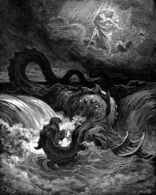

# Moster In  Bible  Christian


## Leviathan 
สัตว์ร้ายที่อยู่ในทะเลขนาดใหญ่  มีหลายหัว มีฟันแหลมคมเหมือนจระเข้ มีดวงตาเหมือนพระอาทิด   
(หมายถึงมันโผล่ตาขึ้นมาเหนือน้ำเหมือนที่จระเข้ทำเวลาล่าเหยื่อ ตามันจะโผล่พ้นน้ำมาเล็กน้อย เหมือนพระอาทิตย์โผล่พ้นเหลี่ยมเขาในตอนเช้า)

บางครั้งมันก็ถูกกล่าวว่าเป็นพลังแห่งความสับสนวุ่นวายเมื่อครั้งสร้างโลก คัมภีร์ปฐมกาลกล่าวว่า "ในปฐมกาลพระเจ้าทรงเนรมิตสร้างฟ้าและแผ่นดินแผ่นดินก็ว่างเปล่า ความมืดอยู่เหนือน้ำ และพระวิญญาณของพระเจ้าปกอยู่เหนือน้ำนั้น" ผืนน้ำนั่นแหละครับคือความสับสนวุ่นวาย และก็คือเลวีอาธาน


### Genesis 1:2
``` 
The earth had no shape and it was empty. Everything was dark, and God’s Spirit moved gently over the waters.
 ```

 ### Extends  Genesis 1:2
 ```
God’s Spirit ‘moved gently’ over the waters. Some birds can hover. It means that they are staying in the same place in the air. But still they are moving their wings. God’s Spirit also did this, like a bird that is looking after its young birds. That was because God cares about his *creation. And so he wants to protect it.

‘The waters’. We are not sure what that means. It might also mean dark gases. It might mean a ‘cloud that consists of darkness’. Or it might mean darkness and waters. The older English texts say ‘the face of the deep’, which means the surface of the sea
```

## Reference
- เพลงสดุดี 74:13-14
```
พระองค์ทรงแยกทะเลด้วยฤทธานุภาพของพระองค์ พระองค์ทรงหักหัวมังกรในน้ำ 14พระองค์ทรงทุบหัวทั้งหลายของเลวีอาธานเป็นชิ้นๆ พระองค์ประทานมันให้เป็นอาหารของคนที่อาศัยอยู่ในถิ่นทุรกันดาร
```

-  โยบ 41 
``` 
ยาวเปิดอ่านเอง  
```
- อิสยาห์ 27:1
```
ในวันนั้น พระเยโฮวาห์จะทรงลงโทษด้วยพระแสงอันร้ายกาจ ยิ่งใหญ่ และแข็งแกร่งของพระองค์ต่อเลวีอาธาน ซึ่งเป็นพญานาคที่ฉกกัด คือเลวีอาธานพญานาคที่ขด และพระองค์จะทรงประหารมังกรที่อยู่ในทะเล 

On that day, the *Lord will seize his powerful sword. The sword is extremely sharp. The *Lord will attack Leviathan, the giant animal in the sea. The *Lord will kill Leviathan, even if it turns in all directions to escape.

```

Extands  Isaiah 27:1
```
‘That day’ is the day of punishment (see the final verse of chapter 26).

·  Forty (40) years after God’s people escaped from Egypt, they entered the country called Canaan (see Joshua 1:11). There they heard about Leviathan. In ancient stories, Leviathan was a very ugly and cruel monster (huge animal). It was the fierce enemy of the gods from Canaan.

·  Isaiah may use the word Leviathan to refer to God’s principal enemy, the devil. But Isaiah also uses the word to refer to Egypt, which was the enemy of God’s people in ancient times.
```

คำว่า "เลวีอาธาน" นั้น ยังหมายถึงสัตว์ประหลาดขนาดยักษ์ หรือสัตว์ขนาดใหญ่ใดๆ ก็ได้ ในภาษาฮิบรูใหม่ คำนี้มีความหมายเพียง วาฬ เท่านั้น


# The Nephilim

[Alt text](img/fall.jpg)

were the offspring of the "sons of God" and the "daughters of men" before the Deluge, according to Genesis 6:1-4.

Extends Genesis 6:4

```
They were giant people, who probably lived in an evil way
```


A similar or identical biblical Hebrew term, read as "Nephilim" by some scholars, or as the word "fallen" by others, appears in Ezekiel 32:27


# Abaddon

[Alt text](img/1724475_767793743248368_1120289665_n.jpg)
Abaddon’s Locusts Abaddon (ฮิบรู) หรือ
Apollyon หรือ Apollion(กรีก) และ
อีกชื่อหนึ่ง Abbaton Abaddon ซึ่งหมายถึงการทำลายล้าง หรือความหายนะ เป็นเทวดาตกสวรรค์ ที่อยู่ในนรกที่ลึกที่สุด (Angel of the bottomless pit) ที่ระบุไว้ในหนังสือ Book of Revelation เป็นที่รู้จักในนาม ผู้ทำลายล้าง (The Destroyer) 


ในหนังสือ Book of Revelation ของ St.John ได้บรรยายไว้ว่า มีร่างกายของม้าศึก หน้ามนุษย์ ผมยาวแบบผู้หญิง เขี้ยวฟันสิงโต มีปีกแบบตั๊กแตน และมีหางโค้งงอมีพิษแบบหางแมงป่อง


## Reference

```
Revelation 9:11—"whose name in Hebrew is Abaddon, The Angel of Death."

They have a king who rules them. He is the *angel in command of the hole whose depth has no end. His name in the *Hebrew language is Abaddon. In the *Greek language, he is Apollyon.
```
## Extends Revelation 

```
The army of *locusts had a king. He was the *angel of the great hole. This *angel was not a servant of God. In fact, this *angel was a servant of the devil. Or perhaps, he was the devil himself. This evil *angel was the leader of the *locusts. He led them as a king leads his arm
```


## Job 26:5-6 
```
“บรรดาผู้ตายต้องทุกข์ทรมาน
ทั้งบรรดาคนที่อยู่ใต้น้ำและทุกชีวิตในนั้น

แดนมรณาเปลือยเปล่าต่อหน้าพระเจ้า
แดนพินาศไร้สิ่งปกปิด

Dead people tremble painfully in a place that is deeper than even the sea. v6 But God sees that place. God even sees hell.
```

## Extends Job 26:5-6
```
Job described hell. Elsewhere, Job was not sure whether hell exists (Job 3:13-14; Job 21:22-26). But in these verses, Job was not explaining his own ideas. Instead, he was speaking by the power of the Holy Spirit.

โยบอธิบายเรื่องนรก ที่อื่นโยบไม่แน่ใจว่านรกนั้นมีอยู่จริงหรือไม่ (โยบ 3: 13-14; โยบ 21: 22-26) แต่ในข้อเหล่านี้โยบไม่ได้อธิบายความคิดของเขาเอง เขากำลังพูดแทนโดยอำนาจของพระวิญญาณบริสุทธิ์
```
##  Job 28:22 (Job’s poem about wisdom) บทกวีของโยบเกี่ยวกับภูมิปัญญา
```
หายนะและความตายกล่าวว่า
‘เราเพียงแต่ได้ยินข่าวเล่าลือมา’

You will not even become wise when you die.
In hell, people can only whisper about wisdom

```

## Extends  Job 28:22
```
he spoke about people who are dead. Neither life nor death can teach you how to be wise.

เขาพูดเกี่ยวกับคนที่ตายแล้ว ทั้งชีวิตและความตายไม่สามารถสอนคุณถึงวิธีการที่ชาญฉลาด

```
## Job 31:12 Job finishes his last speech
```
https://www.easyenglish.bible/bible-commentary/job-lbw.htm
```


